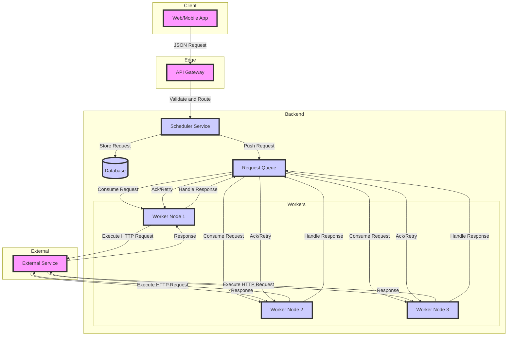

## Design points
## Components

1. **Client**: This can be a web application, mobile app, or any other client that provides a user interface for scheduling HTTP requests at a specific time.

2. **API Gateway**: The API Gateway acts as an entry point for client requests. It can handle authentication, rate limiting, and routing requests to the appropriate service.

3. **Scheduler Service**: This service is responsible for accepting scheduling requests from clients, validating the requests, and storing them in a durable storage (like a database) for future execution.

4. **Request Queue**: This is a queue-based system (e.g., RabbitMQ, Apache Kafka, or AWS SQS) that stores scheduled requests until their execution time. The Scheduler Service pushes scheduled requests to this queue, and Worker Nodes consume requests from this queue for execution.

5. **Worker Nodes**: These are a set of worker processes or servers that consume scheduled requests from the Request Queue and execute the HTTP requests at the specified time. Multiple Worker Nodes can be deployed for scalability and load balancing purposes.

6. **External Service**: This represents the target service (e.g., `https://myservice.com/api/items/_delete`) to which the scheduled HTTP requests are sent.

## Answering Follow-up Questions

1. **How the back-end will interact with Front-end (GUI), JSON request & response body?**
  - The front-end (Client) can interact with the back-end (API Gateway) using a RESTful API.
  - The request body can be in JSON format, containing the details of the scheduled HTTP request, such as the target URL, HTTP method, headers, body, and the scheduled execution time.
  - The response from the API Gateway can also be in JSON format, containing a unique identifier for the scheduled request or any errors that occurred during request validation.

2. **How will you handle different timezones?**
  - The client should specify the timezone along with the scheduled execution time in the request.
  - The Scheduler Service should store the scheduled time in UTC (Coordinated Universal Time) format in the database, along with the timezone information.
  - Worker Nodes should convert the scheduled time from UTC to the appropriate timezone before executing the HTTP request.

3. **How users will know the GUI timezone and what would be the timezone in the backend system?**
  - The client (GUI) can detect the user's timezone using JavaScript or other client-side mechanisms and display it to the user.
  - The backend system (Scheduler Service and Worker Nodes) should use a standard timezone, like UTC, for storing and processing scheduled requests.

4. **How will you handle if the system crashes and restarts to avoid duplicate requests?**
  - The Scheduler Service should use a durable storage (like a database) to store scheduled requests. This ensures that scheduled requests are not lost in case of system crashes or restarts.
  - Worker Nodes should implement idempotency mechanisms, such as keeping track of executed requests (e.g., using a database or in-memory cache) and skipping duplicate requests.
  - The Request Queue should be configured with appropriate delivery guarantees (e.g., at-least-once delivery) to ensure that no scheduled requests are lost in case of Worker Node failures.

## Scalability, Availability, and Reliability

- **Scalability**: The system can be scaled horizontally by adding more Worker Nodes to handle an increasing load of scheduled requests. The Request Queue and the database used by the Scheduler Service should also be designed to handle increased load.

- **Availability**: The system can be made highly available by deploying multiple instances of the API Gateway, Scheduler Service, and Worker Nodes in different availability zones or regions. The Request Queue and the database should also be configured for high availability.

- **Reliability**: The system should implement retry mechanisms and circuit breakers to handle failures when executing HTTP requests to external services. The Scheduler Service and Worker Nodes should also implement monitoring and alerting mechanisms to detect and respond to failures or performance issues.

This design provides a scalable, available, and reliable solution for scheduling and executing HTTP requests at a specified time. However, it's essential to consider factors like security, monitoring, and operational concerns in a production environment.

## Question

A consumer can schedule a request to https://myservice.com/api/items/_delete to be executed on Sunday at 1am. On Sunday at 1am the scheduling system must execute the HTTP request.

Requirements

The system must:

Provide an interface for scheduling HTTP requests at a specified time.
Execute an HTTP request at a specified time.
Initial release expects 10 scheduling requests per minute.
FR -

Provide an interface for scheduling HTTP requests at a specified time.
Execute an HTTP request at a specified time.
Initial release expects 10 scheduling requests per minute.
NFR
Scalling, availability, reliable - Only discussion

There are many follow up questions, few are below which I remember.

How the back-end will interact with Front-end (GUI), json request & response body
How will you handle different timezones?
How users will know the GUI timezone and what would be the timezone in the backend system.
How will you handle if the system crash and restart to avoid duplicate requests.