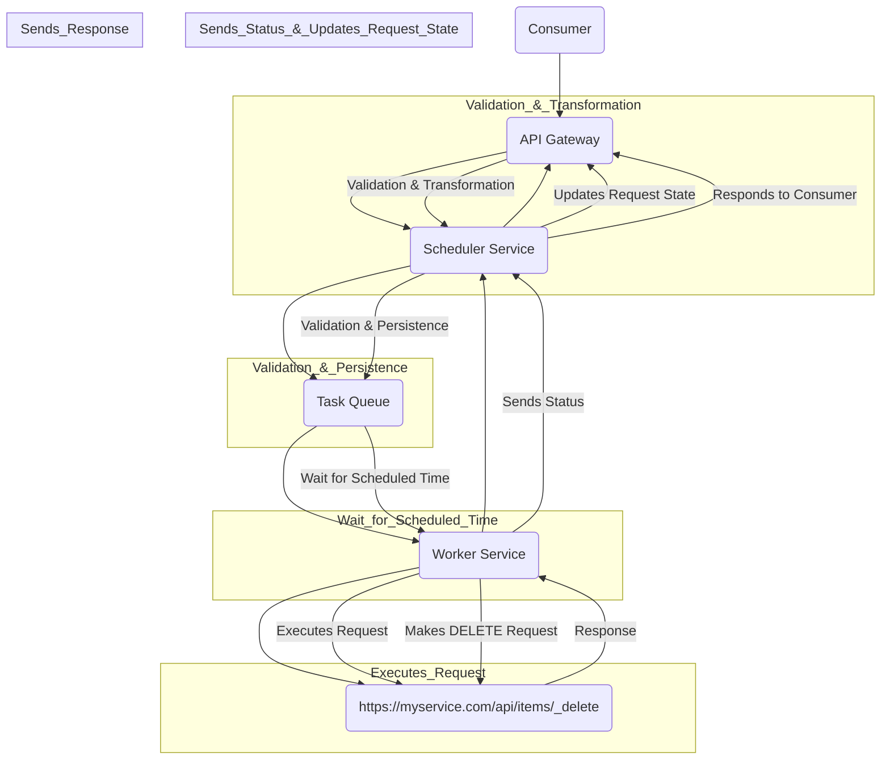

## Scheduled HTTP Requests

System Design for Scheduled HTTP Requests
This design outlines a system for consumers to schedule DELETE requests to a specific URL at a designated time. It caters to the initial requirement of 10 requests per minute and addresses potential scaling, availability, and reliability concerns.

Components:

Scheduler Service:

Functionality:
Accepts scheduling requests from the API Gateway (including target URL, time, and potentially user information).
Validates the request (e.g., valid URL, scheduled time in the future).
Stores the scheduled request in a persistent data store (e.g., database).
Uses a task queue (e.g., RabbitMQ, Apache Kafka) to enqueue a job for execution at the scheduled time.
Scalability:
Horizontally scalable by deploying additional scheduler instances behind a load balancer.
Availability:
Implement fault tolerance through automatic instance restarts.
Consider a message broker with redundancy (e.g., RabbitMQ cluster).
Worker Service:

Functionality:
Continuously listens on the task queue for pending jobs.
Dequeues a job at its scheduled execution time.
Makes the HTTP DELETE request to the target URL (https://myservice.com/api/items/_delete).
Handles potential errors (e.g., network issues, server errors).
Optionally, logs the request execution status (success/failure) with details.
Scalability:
Horizontally scalable by deploying additional worker instances.
Reliability:
Implement retries with backoff for transient errors.
Consider idempotent requests (DELETE is inherently idempotent) to avoid duplicates on retries.
API Gateway:

Functionality:
Provides an interface for consumers to submit scheduling requests.
Validates user credentials and authorization (if applicable).
Transforms user requests into a format accepted by the Scheduler Service.
Forwards requests to the Scheduler Service.
Returns success/failure responses with relevant information to the consumer.
Scalability:
Horizontally scalable by deploying additional API Gateway instances behind a load balancer.
Persistent Data Store:

Functionality:
Stores scheduled requests submitted by consumers.
Manages their state (pending, completed, failed).
Scalability:
Choose a database solution that supports horizontal scaling (e.g., sharded databases).
Task Queue:

Functionality:
Buffers scheduled jobs until their designated execution time.
Ensures order of execution even with multiple worker instances.
Scalability and Availability:
Choose a highly available and scalable message broker solution.
Follow-up Questions:

Front-end and Back-end Interaction:

The API Gateway acts as the intermediary between the front-end UI and back-end services.
Front-end sends JSON requests containing scheduling details (URL, time) to the API Gateway.
API Gateway validates, transforms, and forwards the request to the Scheduler Service.
Responses (success/failure with details) are sent back through the API Gateway to the front-end for user feedback.
Timezones:

The system can handle timezones in two ways:
Client-side conversion: The front-end UI collects the user's preferred timezone and converts the scheduled time to UTC before sending the request. The back-end stores the time in UTC for consistent execution.
Server-side conversion: The API Gateway receives the scheduled time in the user's local timezone and converts it to UTC before forwarding it to the Scheduler Service. The back-end stores the time in UTC.
Regardless of the approach, the user interface should clearly display the selected timezone and scheduled time in the user's preferred format.
Crash Recovery:

The task queue plays a crucial role in avoiding duplicate requests upon system restarts.
Scheduled requests are persisted in the data store.
Upon restart, the Worker Service retrieves pending jobs from the task queue and executes them only once (idempotency of DELETE requests helps).
Additionally, logging successful executions with timestamps can be used for further verification and deduplication.
Additional Considerations:

Security: Implement authentication and authorization mechanisms for scheduling requests.
Monitoring: Monitor system health (scheduler, worker, queue) for timely identification and resolution of issues.
Alerting: Notify administrators of critical events (e.g., service failures, high error rates).





```
Consumer  --> (Submits Request) --> API Gateway
                                        |
                                        | (Validation & Transformation)
                                        v
                                    API Gateway  --> (Forwards Request) --> Scheduler Service
                                                                            |
                                                                            | (Validation & Persistence)
                                                                            v
                                                                        Scheduler Service --> (Creates Job) --> Task Queue
                                                                                                       |
                                                                                                       | (Wait for Scheduled Time)
                                                                                                       v
                                                                                                   Task Queue --> (Delivers Job) --> Worker Service
                                                                                                                                       |
                                                                                                                                       | (Executes Request)
                                                                                                                                       v
                                                                                                                                   Worker Service --> (Makes DELETE Request) --> https://myservice.com/api/items/_delete
                                                                                                                                                                                                |
                                                                                                                                                                                                | (Response)
                                                                                                                                                                                                v
                                                                                                                                                                                            Worker Service --> (Sends Status) --> Scheduler Service
                                                                                                                                                                                                                              |
                                                                                                                                                                                                                              | (Updates Request State)
                                                                                                                                                                                                                              v
                                                                                                                                                                                                                          Scheduler Service --> (Responds to Consumer) --> API Gateway
                                                                                                                                                                                                                                                                   |
                                                                                                                                                                                                                                                                   | (Sends Response)
                                                                                                                                                                                                                                                                   v
                                                                                                                                                                                                                                                               Consumer
                                                                                                                                                    ```                                                                                                           