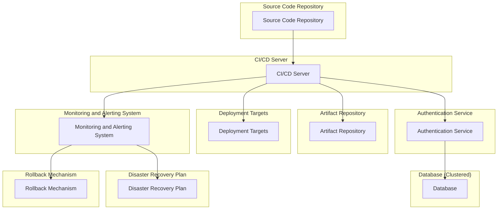

## Highly Available CI/CD Pipeline

Design a CI/CD pipeline that ensures high availability and fault tolerance. Consider disaster recovery and rollbacks.

### Diagram

#### Components:

**Source Code Repository**: Stores the application source code and version control history. Popular options include Git, GitHub, GitLab, and Bitbucket.

**CI/CD Server (Jenkins, GitLab CI, etc.)**: Automates the build, test, and deployment processes. Monitors the source code repository for changes and triggers pipelines accordingly.

**Artifact Repository**: Stores build artifacts generated during the CI/CD process. Examples include Docker registries, Nexus, Artifactory, or AWS S3.

**Deployment Targets**: Environments where the application is deployed for testing, staging, and production. These may include Kubernetes clusters, virtual machines, or cloud platforms like AWS, Azure, or Google Cloud.

**Monitoring and Alerting System**: Monitors the health and performance of the CI/CD pipeline, including build success rates, deployment times, and system availability. Alerts are triggered for anomalies or failures.

**Authentication Service (Clustered)**: Handles user authentication and authorization for accessing the CI/CD pipeline. This could be implemented using OAuth, LDAP, or SAML. The authentication service is clustered for high availability and fault tolerance.

**Database (Clustered)**: Stores metadata and configuration information for the CI/CD pipeline. Utilizes database clustering for high availability, fault tolerance, and scalability.

**Disaster Recovery Plan**: Includes procedures for recovering the CI/CD pipeline in the event of a disaster, such as hardware failure, data corruption, or infrastructure outage.

**Rollback Mechanism**: Enables rollback to a previous stable version of the application in case of deployment failures or production issues.

**SLAs and SLOs**: Defines Service Level Agreements (SLAs) and Service Level Objectives (SLOs) for the CI/CD pipeline, including uptime, response times, and error rates.

#### Key Considerations:

- **High Availability**: The entire CI/CD pipeline, including authentication service, database, and other components, should be designed for high availability to minimize downtime and ensure continuous operation.

- **Fault Tolerance**: Redundancy and failover mechanisms are implemented for all components to mitigate the impact of component failures and ensure uninterrupted operation.

- **Authentication Mechanism**: An authentication service is implemented to handle user authentication and authorization securely. The authentication service is clustered for high availability and fault tolerance.

- **Database Clustering**: The database is clustered to ensure high availability, fault tolerance, and scalability. Database clustering distributes data across multiple nodes and provides redundancy in case of node failures.

- **Disaster Recovery**: A disaster recovery plan is in place to restore the CI/CD pipeline in the event of catastrophic failures or data loss.

- **Rollback Procedures**: Automated rollback procedures are established to revert to a previous stable version of the application in case of deployment failures or production issues.

- **Monitoring and Alerting**: Comprehensive monitoring and alerting systems are implemented to detect and respond to anomalies, failures, and performance degradation in real-time.

- **SLAs and SLOs**: Service Level Agreements (SLAs) and Service Level Objectives (SLOs) are defined to measure and maintain the reliability, availability, and performance of the CI/CD pipeline.
