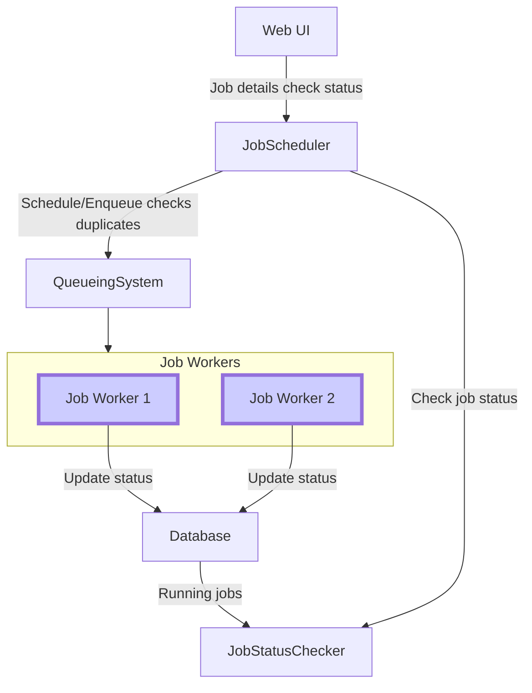

## Job_Submission_Service

FR:
- Engineers can submit a processing job
- Engineers can specify the time that they'd like the job to run
- The output of the job will be written somewhere that the engineer can retrieve it from
- Ensure the status of each job run is maintained. Each job once started running should ensure other same job is not started at same time or give warning

NFR


---



---
### Components

**Web Interface**: This allows engineers to submit jobs. The interface can accept details like:

Script to be run (text editor for inline script or file upload)
Destination server details (IP address, username, password) - secured storage recommended
Desired execution time (calendar with time selection)
Job name (for identification)


**Job Scheduler**: This service is responsible for:

Receiving job submissions from the web interface.
Validating job details (script format, destination reachability).
Storing job metadata (name, script, destination, desired time) in a database.
Scheduling jobs based on desired execution time using a queuing mechanism (explained later).
Enforcing job dependencies (preventing concurrent runs of the same job).

**Job Worker**: This service runs on worker nodes (potentially multiple servers) and is responsible for:

Picking up jobs from the queue based on scheduling information.
Establishing a secure connection to the destination server using the provided credentials.
Executing the submitted script on the destination server.
Capturing the job output (logs, data files).
Storing the output in a designated location accessible to the engineer (e.g., designated folder on a shared drive).
Updating the job status in the database (started, completed, failed) with any error messages.

**Database**: This stores information about submitted jobs:

Job ID (unique identifier)
Job name
Script details (stored securely)
Destination server details (stored securely)
Desired execution time
Scheduled execution time (may differ based on queue position)
Job status (submitted, pending, running, completed, failed) with timestamps
Job output location (if applicable)

**Queueing System**: This acts as a buffer between the Job Scheduler and Job Worker:

Jobs are added to the queue based on their desired execution time (priority queue possible).
The Job Worker picks up jobs from the front of the queue for execution.
This ensures a first-in-first-served (FIFO) order by default, with the option for priority scheduling if needed.
Job Dependency and Concurrency Control:

When a job is submitted, the scheduler checks the database for existing jobs with the same name.
If a job with the same name is already running or pending execution, the scheduler can:
Reject the submission with a warning about a conflicting job.
Allow submission but mark it as "pending on previous completion" and update the queue accordingly.

**Output Retrieval**:

The Job Scheduler updates the job record with the output location after successful execution.
The engineer can retrieve the output by accessing the designated location (e.g., designated folder) using their credentials. The web interface can potentially display the output location upon job completion.
Technology Stack Considerations:

**Web Interface**: Web framework like Django, Flask, or React.js
Job Scheduler: Distributed task scheduler like Celery, Apache Airflow, or Kubernetes CronJobs.
Job Worker: Scripting language like Python or Bash for script execution and interaction with the destination server.
Database: Relational database like MySQL or PostgreSQL.
Queueing System: Message queueing system like RabbitMQ, Kafka, or Amazon SQS.
Additional Considerations:

**Security**: Securely store script details and destination server credentials in the database. Consider encryption at rest and in transit.
Monitoring: Implement monitoring for job failures, worker health, and queue backlog.
Scalability: Design the system to handle an increasing number of jobs and workers.
This design provides a basic framework for job submission and scheduling. You can customize it further based on your specific needs and chosen technologies.


```
                          +------------+
                          | Web UI     | (Submits jobs)
                          +------------+
                                 ^
                                 | (Job details)
                          +------------+
                          | Job Scheduler |
                          +------------+
                                 ^
                                 | (Job queue)
                          +------------+
                          | Queueing System |
                          +------------+
                                 ^       ^
                                 |       | (Execute jobs)
                          +------------+       +------------+
                          | Job Worker  | ----  | Job Worker  |
                          +------------+       +------------+
                                 ^       ^
                                 |       | (Store output)
                          +------------+       +------------+
                          | Database    |
                          +------------+
                             ^
                             | (Job status, output location)
                             +------------+

```