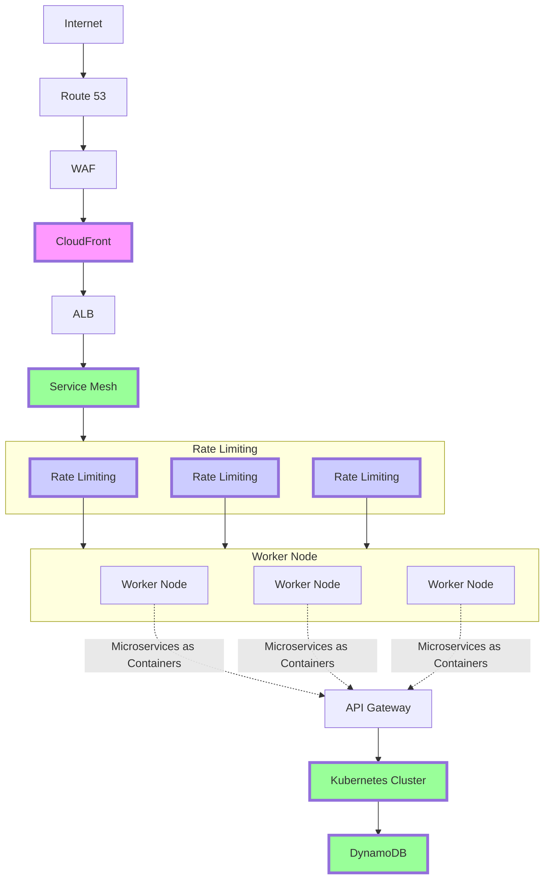

- **Route 53**: Routes users to the closest healthy endpoint.
- **WAF**: Filters out malicious traffic.
- **CloudFront (Optional)**: Caches static content for faster delivery.
- **ALB**: Distributes traffic across the service mesh for rate limiting.
- **Service Mesh (Scalable Rate Limiting)**: Utilizes containerized rate limiting services for horizontal scaling. This includes multiple instances of the rate limiting container for increased capacity.
- **Kubernetes Cluster (Scalable)**: Manages containerized microservices running on worker nodes.
- **Microservices (as Containers)**: Your application broken down into independent, loosely coupled services.
- **API Gateway**: Manages API calls to your microservices.
- **DynamoDB (Scalable Database)**: Stores rate limiting counters and other application data.



```
                                  +---------------+
                                  |     Internet   |
                                  +---------------+
                                                   |
                                               +-----------+
                                               |  Route 53  |
                                               +-----------+
                                                   |
                                               +-----------+
                                               |    WAF     |
                                               +-----------+
                                                   |
                                               +-----------+
                                               |  CloudFront | (Optional)
                                               +-----------+
                                                   |
                                               +-----------+          +-----------+
                                               |  ALB     |          |  Service Mesh  (Scalable Rate Limiting) |
                                               +-----------+          +-----------+
                                                                                |
                                                                            +-----------+         +-----------+         +-----------+
                                                                            |  Rate Limiting  |         |  Rate Limiting  |         |  Rate Limiting  | (Containers)
                                                                            +-----------+         +-----------+         +-----------+
                                                                                |
                                                                            +-----------+
                                                                                |
                             +-----------+          +-----------+
                             | Worker Node |         | Worker Node |         | Worker Node |
                             +-----------+         +-----------+         +-----------+
                                                 |                     |                     |
                                          (Microservices as Containers)
                                                 |                     |                     |
                             +-----------+         +-----------+         +-----------+
                                                   |
                             +-----------+          +-----------+
                             |  API Gateway  |          |  Kubernetes Cluster  (Scalable) |
                             +-----------+          +-----------------+
                                                   |                      |
                                               +-----------+         +-----------+         +-----------+
                                               |  DynamoDB   | (Scalable Database)
                                               +-----------+

```