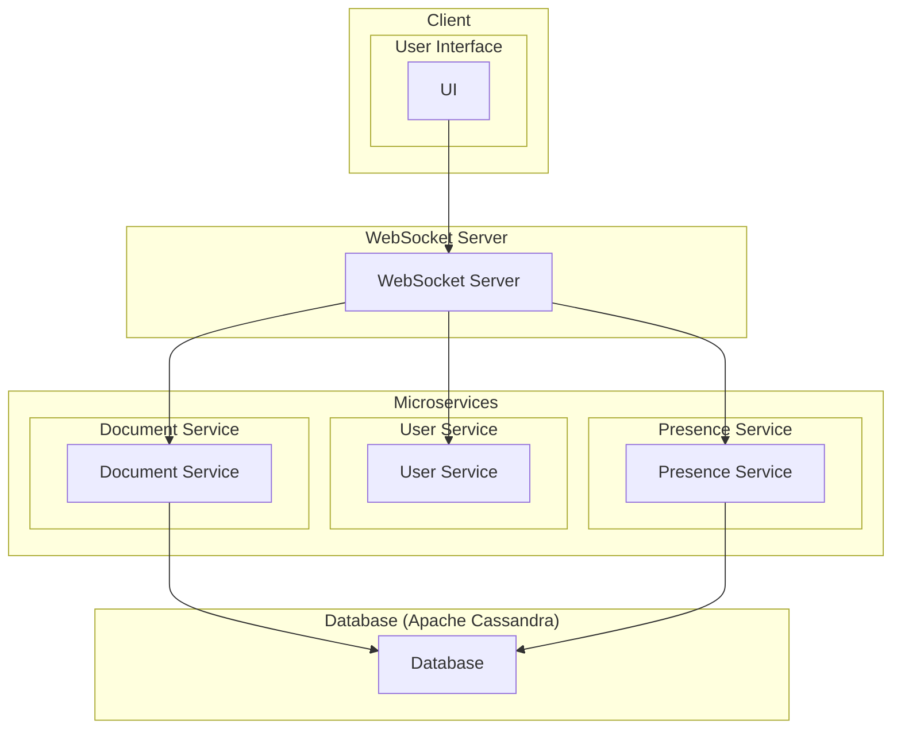

## Real-time Collaboration Platform

Design a real-time collaboration platform for teams (think Confluence). Discuss aspects like data consistency, low latency updates, and user presence management.

## Diagram

#### Components:

**WebSocket Server**: Handles real-time communication between clients and the server. Utilizes WebSocket protocol for low-latency updates.

**Database (Apache Cassandra)**: Stores collaborative documents and user data. Utilizes sharding for horizontal scalability, clustering for fault tolerance, and caching for improved read performance.

**User Service (Microservice)**: Manages user accounts, authentication, and authorization.

**Document Service (Microservice)**: Handles CRUD operations for collaborative documents. Interacts with the Cassandra database for data storage and retrieval.

**Presence Service (Microservice)**: Manages user presence status to indicate active users in real-time.

#### Key Considerations:

- **Sharding**: Apache Cassandra supports sharding, allowing data to be distributed across multiple nodes based on a shard key. This enables horizontal scalability by adding more nodes to the cluster.

- **Clustering**: Cassandra uses replication and clustering to ensure fault tolerance and high availability. Data is replicated across multiple nodes, and each node participates in a ring topology for data distribution and replication.

- **Caching**: Cassandra provides built-in caching mechanisms like row cache and key cache, which can be configured to cache frequently accessed data. This reduces the number of disk reads and improves overall read performance.

#### Additional Considerations for Conflict Resolution:

1. **Conflict Detection**: The system should be able to detect conflicts when multiple users attempt to edit the same document simultaneously. This could involve comparing versions of the document or tracking changes made by different users.

2. **Conflict Resolution Strategies**: Various strategies can be employed to resolve conflicts when they occur. These strategies may include last writer wins, merging changes, manual resolution by users, or applying predefined conflict resolution rules.

3. **Timestamps and Versioning**: Timestamps or versioning can be used to track the sequence of edits made by different users. This information can be used to identify conflicting changes and determine the order in which they were made.

4. **Automated Conflict Resolution**: In some cases, conflicts can be automatically resolved based on predefined rules or algorithms. For example, conflicts may be resolved by merging changes from different users or by applying prioritization rules.

5. **User Notifications**: Users should be notified when conflicts occur and when their changes conflict with changes made by other users. This helps to ensure transparency and facilitates manual resolution when necessary.

6. **User Collaboration Features**: Providing collaboration features such as real-time presence indicators, collaborative cursors, and user avatars can help reduce the likelihood of conflicts by making it clear who is currently editing a document or resource.

7. **Audit Trails**: Maintaining an audit trail of changes made by different users can aid in resolving conflicts and tracking the history of edits. This information can also be useful for troubleshooting and accountability purposes.
