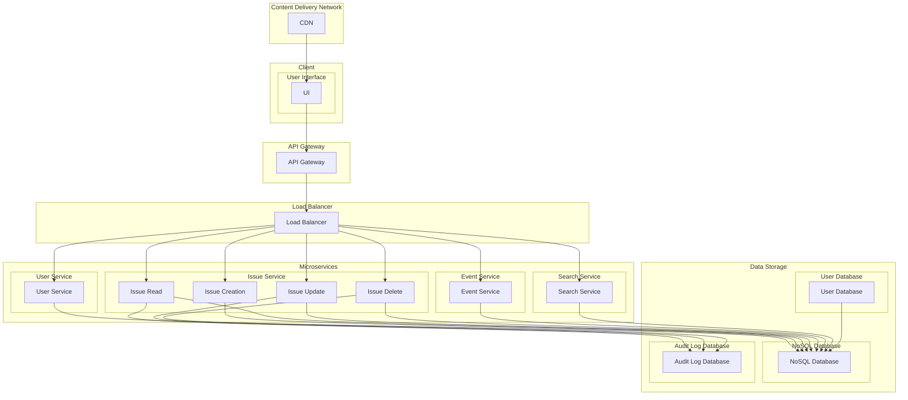

## Scalable Issue Tracking System

Design a highly scalable issue tracking system used by millions of users. Discuss scaling aspects like data storage, API design, and handling high load.

## Diagram

## Components

**API Gateway**: (Scalable & Load-balanced) Single entry point for API requests. Uses an API Gateway with auto-scaling to handle high traffic volumes.

**Load Balancer**: Distributes traffic across backend services for high availability. Consider a multi-tier load balancer with regional deployments for global reach.

**User Service (Microservice)**: (Horizontally Scalable) Manages user accounts, authentication, and authorization. Can be scaled horizontally by adding more instances.

**Issue Service (Microservice)**: (Horizontally Scalable, Database Sharding) Stores and manages issue data. Uses a horizontally scalable NoSQL database with sharding for efficient data distribution.

**Event Service (Microservice)**: (Horizontally Scalable, Message Queue) Publishes and subscribes to events related to issues. Utilizes a message queue like Kafka for asynchronous event handling.

**Search Service (Microservice)**: (Vertically Scalable, Search Engine) Enables searching and filtering of issues. May be vertically scaled with powerful search engines.

**Database (NoSQL with Sharding)**: Stores issue data. We use a horizontally scalable NoSQL database like Cassandra with sharding to distribute data across multiple nodes and improve read/write performance.

**User Database (Relational)**: Stores user data. A relational database like MySQL or Postgres provides ACID transactions and efficient user data management.

**Content Delivery Network (CDN)**: Delivers static content (images, CSS) geographically for faster loading times.

