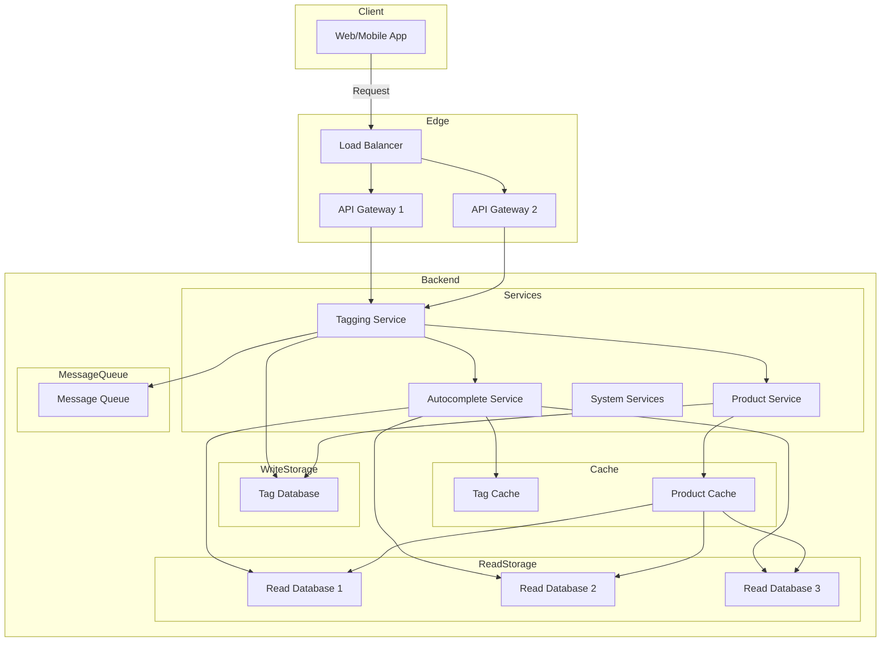

## Components

1. **Client**: The client component (Web/Mobile App) that allows users to create tags, add tags to products, and search for tags/products.

2. **Load Balancer**: Distributes incoming requests across multiple API Gateway instances for scalability and high availability.

3. **API Gateway**: Handles client requests, authentication, rate limiting, and routing to the appropriate service.

4. **Tagging Service**: Responsible for creating tags and associating tags with products. It stores tags in the Tag Database and publishes tag creation events to the Message Queue.

5. **Tag Database**: Stores tag information, including name, description, and associated products.

6. **Product Service**: Manages product data and associates tags with products. It stores product data in the Product Database.

7. **Product Database**: Stores product information, including associated tags.

8. **Autocomplete Service**: Consumes tag creation events from the Message Queue and updates the Search Cache for efficient autocomplete suggestions.

9. **Search Cache**: An in-memory cache (e.g., Redis) that stores tag information for fast autocomplete suggestions.

10. **Message Queue**: A persistent queue (e.g., Apache Kafka, RabbitMQ) that decouples the Tagging Service and Autocomplete Service, ensuring eventual consistency for autocomplete suggestions.

## Workflow

1. The client sends a request to create a tag, add a tag to a product, or search for tags/products.

2. The Load Balancer distributes the request to an available API Gateway instance.

3. The API Gateway routes the request to the appropriate service based on the request type:
   - For creating a tag, the request is sent to the Tagging Service.
   - For adding a tag to a product, the request is sent to both the Tagging Service and the Product Service.
   - For searching tags or products, the request is sent to the Autocomplete Service.

4. The Tagging Service creates the tag and stores it in the Tag Database. It also publishes a tag creation event to the Message Queue.

5. The Autocomplete Service consumes the tag creation event from the Message Queue and updates the Search Cache with the new tag information.

6. For autocomplete suggestions, the Autocomplete Service queries the Search Cache to provide fast and low-latency responses.

7. For searching products by tags, the Autocomplete Service queries the Tag Database and the Product Database to retrieve the relevant product information.

### Addressing NFRs:

- **Highly Scalable**: The system can be scaled horizontally by adding more instances of API Gateways, Services, and Databases as needed. The Load Balancer distributes the load across multiple instances.
- **Low Latency Autocomplete**: The Search Cache (e.g., Redis) provides low-latency autocomplete suggestions by storing tag information in memory.
- **Efficient Tag Storage**: The Tagging Service checks for duplicate or similar tags before creating a new tag in the Tag Database, ensuring efficient storage and preventing redundancy.
- **Eventual Consistency**: The use of the Message Queue and the Autocomplete Service ensures eventual consistency for autocomplete suggestions. Tags created might not be immediately visible in autocomplete, but they will be visible eventually within the specified SLA (1-2 seconds).