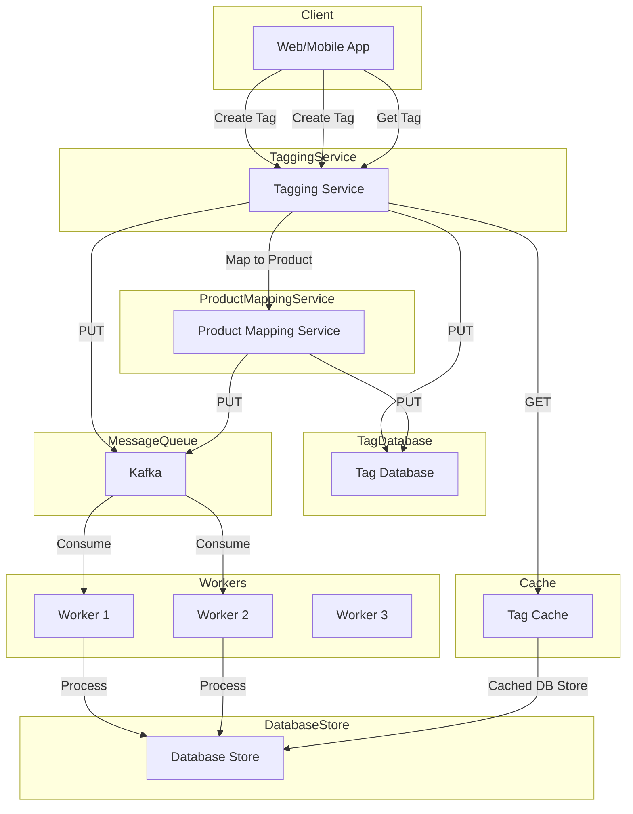

## Components

**Client (Web/Mobile App):** Initiates actions such as creating a tag or requesting tag information.

**Tagging Service:** Handles tag creation requests from the client. It interacts with the Tag Database to store tag information. Additionally, it publishes messages to Kafka for further processing.

**Product Mapping Service:** Handles mapping tags to products. It interacts with the Tag Database to update tag-product mappings. Similar to the Tagging Service, it also publishes messages to Kafka.

**Tag Database:** Stores tag information. Both the Tagging Service and Product Mapping Service interact with this database.

**Kafka:** Serves as a message broker. It receives messages from the Tagging Service and Product Mapping Service and forwards them to the workers for processing.

**Workers:** Consumes messages from Kafka and performs necessary tasks such as indexing, updating, or processing tag-related data. After processing, they update the Database Store.

**Database Store:** Stores the processed tag and tag-product mapping data.

**Tag Cache:** Optionally, a cache layer may exist to store frequently accessed tag information for faster retrieval. The Tagging Service can fetch tag information from this cache before querying the Database Store directly.

## Workflow

1. The client sends a request to create a tag, add a tag to a product, or search for tags/products.

2. The Load Balancer distributes the request to an available API Gateway instance.

3. The API Gateway routes the request to the appropriate service based on the request type:
   - For creating a tag, the request is sent to the Tagging Service.
   - For adding a tag to a product, the request is sent to both the Tagging Service and the Product Service.
   - For searching tags or products, the request is sent to the Autocomplete Service.

4. The Tagging Service creates the tag and stores it in the Tag Database. It also publishes a tag creation event to the Message Queue.

5. The Autocomplete Service consumes the tag creation event from the Message Queue and updates the Search Cache with the new tag information.

6. For autocomplete suggestions, the Autocomplete Service queries the Search Cache to provide fast and low-latency responses.

7. For searching products by tags, the Autocomplete Service queries the Tag Database and the Product Database to retrieve the relevant product information.

### Addressing NFRs:

- **Highly Scalable**: The system can be scaled horizontally by adding more instances of API Gateways, Services, and Databases as needed. The Load Balancer distributes the load across multiple instances.
- **Low Latency Autocomplete**: The Search Cache (e.g., Redis) provides low-latency autocomplete suggestions by storing tag information in memory.
- **Efficient Tag Storage**: The Tagging Service checks for duplicate or similar tags before creating a new tag in the Tag Database, ensuring efficient storage and preventing redundancy.
- **Eventual Consistency**: The use of the Message Queue and the Autocomplete Service ensures eventual consistency for autocomplete suggestions. Tags created might not be immediately visible in autocomplete, but they will be visible eventually within the specified SLA (1-2 seconds).